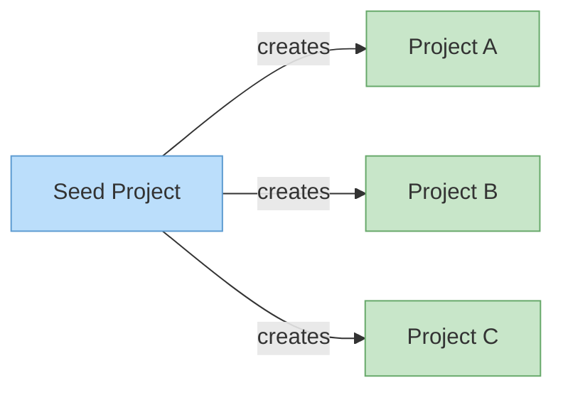

# Terraform GCP Project of Projects

Bootstrap multiple GCP projects with Terraform state management and GitHub Actions OIDC from a single seed project.

Each managed project gets:
- Terraform service account (Owner role)
- State bucket (versioned GCS)
- GitHub Actions OIDC (keyless CI/CD)
- Custom APIs and IAM bindings

## Architecture



## Quick Start

```bash
# 1. Bootstrap seed project (one-time)
# See docs/bootstrap.md

# 2. Configure your projects
cd projects
cp terraform.tfvars.example terraform.tfvars
# Edit terraform.tfvars with your values

# 3. Create projects
terraform init
terraform apply
```

## Documentation

| Document | Description |
|----------|-------------|
| [Getting Started](docs/README.md) | Overview and documentation index |
| [Bootstrap Guide](docs/bootstrap.md) | One-time seed project setup |
| [Usage Guide](docs/usage.md) | Configuration, commands, and examples |

## Project Structure

```
├── projects/                 # Terraform configuration
│   ├── main.tf
│   ├── variables.tf
│   ├── outputs.tf
│   └── modules/gcp-project/
└── docs/                     # Documentation
```

## License

MIT
